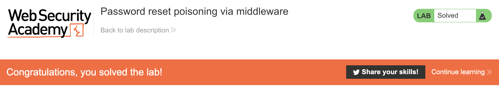

# Lab: Password reset poisoning via middleware

- [Link](https://portswigger.net/web-security/authentication/other-mechanisms/lab-password-reset-poisoning-via-middleware)

## Tips

In this lab you're given a variety of resources and you need to use them well!

Even though you have an e-mail client and an exploit server, the first thing you need to do is investigate how the reset password works. How the requests are made? Can we play with the request body and header? Can we manipulate to change the reset password behaviour in some way?

Click to expand!

I won't give you directly which header it is, but take a look [here](https://developer.mozilla.org/en-US/docs/Web/HTTP/Headers#proxies) and see if you can play with them!
  

Now that you manipulated the reset password funcionality, it's time to play with the exploit server. If you already solved other labs, the exploit server here works exactly like the others. So, you know what to do! Otherwise, explore a little to understand this server capabilities!

Finally, it's poison time! :smiling_imp: :skull_and_crossbones:

Take advantage of `carlos` not recommended behaviour and manipulate the reset password functionality to e-mail him with an exploit server link!

Intercept the reset password token and change `carlos` password to ultimately see:

:tada: :tada: :tada: :tada: :tada:

